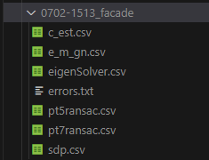
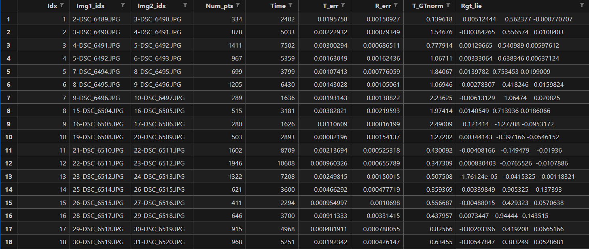
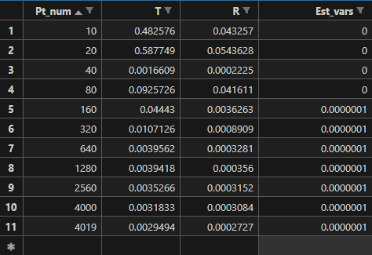
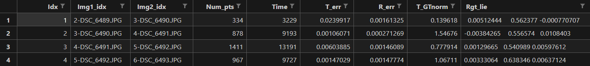

# Two-View Geometry Evaluation

**[README zh-cn 中文](# 对极几何评估工具)**

[TOC]

## Introduction

This repository is used for evaluating several state-of-the-art epipolar-geometry estimators, which are:

- **RANSAC/LMEDS-5pt**：(using the interface of [OpenCV](https://github.com/opencv/opencv), also called “Stewenius” and “Nister”)

- **E_MGN**：**Gauss-Newton optimization on the essential matrix manifold**, implemented using Eigen3

   [Essential Matrix Estimation Using Gauss-Newton Iterations on a Manifold](https://link.springer.com/article/10.1007/s11263-006-0005-0)

- **E_SDP**：**Modeling the optimization of the essential matrix as an SDP problem**, with open source code provided by the author 

  [An Efficient Solution to Non-Minimal Case Essential Matrix Estimation](https://ieeexplore.ieee.org/document/9220804)

- **EigenSolver**：**Optimization of rotation degrees of freedom using eigenvalue optimization** (using the interface of [OpenGV](https://github.com/laurentkneip/opengv)) 

  [Direct Optimization of Frame-to-Frame Rotation](https://ieeexplore.ieee.org/document/6751403)

- **Consistent_est**：**Global Consistent Optimizer with Bias Elimination** (our method, SOTA!)

Among them, the algorithms that require initial values (E_MGN, EigenSolver) use the solution of 5pt-RANSAC as the initial value.

The evaluation uses the Multiview dataset from ETH3D, which can be found at: [Datasets - ETH3D](https://www.eth3d.net/datasets#high-res-multi-view). Information about the dataset can be found in the documentation: [Documentation - ETH3D](https://www.eth3d.net/documentation). We have also modified the data loader for convenient data association between any two images. Their source code is available at: [ETH3D/format-loader](https://github.com/ETH3D/format-loader).

If you encounter any problems or have any questions while using this repository, use **issue** with detailed nformation if possible. Of course, feel free to contact us via email: [zengqingcheng@cuhk.edu.cn](mailto:zengqingcheng@cuhk.edu.cn)

## Installation

> The code in this repository has been compiled and tested on Windows using [Msys2-MinGW64](https://www.msys2.org/). Therefore, in theory, it should also work on Linux systems after installing `cmake`, `build-essential`, and the dependencies listed below.

The dependencies of this repository include:

1. [Eigen3](https://eigen.tuxfamily.org/index.php?title=Main_Page)
2. [SDPA](https://sdpa.sourceforge.net/)
3. [OpenCV](https://github.com/opencv/opencv)
4. [OpenGV](https://github.com/laurentkneip/opengv)

OpenGV and SDPA need to be compiled from source code, while other dependencies can be installed directly from software repositories.

> SDPA seems to be installable from the software repository. You can try that. However, the `FindSDPA.cmake` used in this repository has been set with a absolute path to the compiled lib, so you may need to make some modifications to it (use `find_package(SDPA REQUIRED)` instead).

## Usage

1. First, download the ETH3D dataset:

   https://www.eth3d.net/data/multi_view_test_dslr_undistorted.7z

   https://www.eth3d.net/data/multi_view_training_dslr_undistorted.7z

   Create a `dataset` folder in the root directory of the repository and extract the contents of the compressed files into it. If you also want to evaluate the low-res dataset, download these two as well:

   https://www.eth3d.net/data/multi_view_training_rig_undistorted.7z

   https://www.eth3d.net/data/multi_view_test_rig_undistorted.7z

   > Important: **To facilitate evaluation, rename the `rig_calibration_undistorted` folder under each dataset in the low-res dataset to the same as `dslr_calibration_undistorted` in the high-res dataset.**

   All 2D points used for evaluation here have already been undistorted.

2. Modify `CMakeLists.txt`

   ```cmake
   # you can also add config.cmake of opengv to camke prefix and use find_package(OpenGV REQUIRED)
   # Set the library path and header directory of OpenGV
   set(OpenGV_LIBS "D:/Desktop/epipolar_eval/opengv/lib/libopengv.a")
   include_directories("D:/Desktop/epipolar_eval/opengv/include")
   
   # Path to your mumps include folder, for Windows user only
   # By default, when building SDPA, the mumps lib will be built in the sdpa/mumps/build/lib folder
   # If you install SDPA from software repo, comment this line
   # If installing on Windows, you need to compile the SDPA library first and then add the mumps include folder under SDPA here
   include_directories("D:/Desktop/epipolar_eval/sdpa/mumps/build/include") 
   ```

   > - **For Windows users**, you also need to modify the content of `cmake/FindSDPA.cmake` in the root directory:
   >
   >   ```cmake
   >   set(SDPA_ROOT_DIR "D:/Desktop/epipolar_eval/sdpa")
   >   # Modify it to the path of your sdpa root directory
   >   ```
   >
   >   Modify the following library paths to the corresponding paths:
   >
   >   ```cmake
   >   find_library(BLAS_LIBRARY libopenblas.a HINTS  "D:/Msys2/mingw64/lib")
   >   find_library(FORTRAN_LIBRARY libgfortran.dll.a HINTS "D:/Msys2/mingw64/lib/gcc/x86_64-w64-mingw32/13.1.0")
   >   find_library(FORTRAN_LIBRARY2 libquadmath.dll.a	HINTS "D:/Msys2/mingw64/lib")
   >   ```
   >
   >   We recommend installing these libraries through the Msys2 MinGW64 toolchain.
   >
   > - **For Linux users**, modify the paths as follows:
   >
   >   ```cmake
   >   Codefind_library(BLAS_LIBRARY libopenblas.a	HINTS "${SDPA_ROOT_DIR}/OpenBLAS")
   >       find_library(FORTRAN_LIBRARY libgfortran.so.3 HINTS "/usr/lib/x86_64-linux-gnu/")
   >       find_library(FORTRAN_LIBRARY2 libquadmath.so.0	HINTS "/usr/lib/x86_64-linux-gnu/")
   >   ```

3. Compile

   ```shell
   mkdir build
   cd build
   cmake ..
   make -j12
   ```

   We recommend using `Ninja` for faster compilation.

4. Run the program with the following command format:

   ```shell
   ./epipolar_eval <datasetname>  <img_windows_size> # linux/unix user
   ./epipolar_eval.exe <datasetname>  <img_windows_size> # windows user
   ```

   `datasetname` is the name of the dataset you want to evaluate, and `img_windows_size` is the interval between two images used for evaluation. If it is set to `2`, only adjacent image pairs will be evaluated; if it is set to `3`, adjacent three images will be evaluated, and so on. When this value is set to `-1`, the program will evaluate all image pairs in the dataset.

5. The evaluation results will be saved under the `build` folder in both `CSV` and `TXT` formats. The CSV file contains information about the pose estimation error for each method in each round, while the TXT file provides a comparison of the errors and computation times for different methods.**The rotation error is measured by the Frobenius norm of the error matrix(R_est-R_gt), and the translation error is measured by the normalized error vector’s Euclid norm(T_est-T_gt)**

   

   

6. If you want to continuously evaluate all datasets, we provide script files `evaluate.ps1` (for Windows) and `evaluate.sh` (for Linux/Unix). Running these scripts requires passing two parameters:

   ```sh
   # The format is <script-name> <img_windows_size> <parallel_task_num>
   
   # Run on Windows with a window size of 2 and a maximum of 3 concurrent evaluation tasks
   .\evaluate.ps1 2 3 
   
   # Run on Linux, evaluating all image pairs simultaneously with 10 concurrent evaluation tasks
   .\evaluate.sh -1 10 
   ```

   The program will automatically start evaluating all datasets, and the results will be saved in the `build` folder. If you want to speed up the evaluation process, increase the value of the second parameter, `parallel_task_num`, while ensuring sufficient memory.

- **Note** that due to the large number of images in low resolution datasets (~1000 images per scene), it is recommended to evaluate them separately from high resolution datasets. It is recommended to add the same prefix to the folders of low resolution datasets, so that they can be evaluated separately by modifying the auto-run script. We also provide examples in the script in the form of annotation。

***Optional*** : If you pass the fourth argument to the executable (can be any value), it will save the image pairs with larger errors. The images will be concatenated, and the corresponding point pairs will be connected with lines. The saved images will have the same path as the evaluation results. If you want to modify this functionality, please refer to the code. 

If you think there is some problem with a specific pair of evaluation, find img idx in `CSV` file, then check imgs yourself. The points may possibly lie in the same plane which can cause degeneration.

**In addition,** we found that there are a little bit more outliers (~5%) in low-resolution scenarios when using the dataset(while there are almost no mismatches cases in the high-res ones), which can cause some methods without robust estimation process（like ransac） to fail in these scenarios. If you want to remove their influence for fair comparison, please find below line in `CMakeLists.txt`:

```cmake
# add_definitions(-DREMOVE_OUTLIER)
```

and remove the comment to enable **robust estimation**.

## Evaluate the Consistency

We also provide `m_pts_eval.cc` for evaluating how the performance of the algorithm changes with an increasing number of available matching points. The `CMakeLists.txt` file has already enabled the building of the `MonteCarlo` program by default, which can be disabled if not needed.

The program can be used as follows:

```shell
./MonteCarlo <datasetname> <num_pts> <pair_num1> <pair_num2> <sample_num>
```

The first argument passed is the name of the dataset for which consistency evaluation is to be performed, `num_pts` is the number of associated point pairs used, followed by the indices of the two images used for pairing, and the last argument is the number of repeated samples for evaluation. The evaluation result is saved in the form of pose error in various `CSV` files under the `build/m-consistent-<dataset_name>-<imgidx1>-<imgidx2>` folder.

As using this program alone can be cumbersome, we provide `m-consistent_eval.sh` in the root directory for continuous evaluation:

```shell
./m-consistent_eval.sh dataset max_parallel imgidx1 imgidx2 sample_size
```

The parameters are consistent with the program call, where `max_parallel` specifies the maximum number of parallelism to speed up the evaluation. If you want to modify the number of points sampled each time, modify the elements in the 

```shell
num_pts=(10 20 40 80 160 320 640 1280 2560 4000 -1)
```

 array in `m-consistent_eval.sh` to the desired value. Here, -1 means using all point pairs in the two images. After running, the results will be saved in `build/m-consistent-<dataset_name>-<imgidx1>-<imgidx2>` in an increasing order of corresponding point numbers, which can intuitively show how the algorithm's performance changes with an increasing number of points.



As consistency evaluation requires you to manually select the indices of two corresponding images, we recommend that you first run the basic evaluation, then look for the image pairs you need in its results, and then use them as input for consistency evaluation:



The prefix of the image path in `Img1_idx` and `Img2_idx` is the index of the image in the dataset scene. Use them as input for consistency evaluation.

> If you look at the code, you will find that this is a rather clumsy implementation, but the author is lazy and does not want to rewrite it. If you are interested, you can modify it so that the image and point data do not need to be re-read every time when evaluating consistency, although this will not speed up the process too much.

## Open-source Code Used in this repo

- [ETH3D/format-loader: Example code for loading the dataset format. (github.com)](https://github.com/ETH3D/format-loader)
- [jizhaox/npt-pose (github.com)](https://github.com/jizhaox/npt-pose)
- [laurentkneip/opengv: OpenGV is a collection of computer vision methods for solving geometric vision problems. It is hosted and maintained by the Mobile Perception Lab of ShanghaiTech. (github.com)](https://github.com/laurentkneip/opengv)
- [opencv/opencv: Open Source Computer Vision Library (github.com)](https://github.com/opencv/opencv)
- https://eigen.tuxfamily.org/index.php?title=Main_Page

## Citation

If you use the code from this repository, please cite our paper:


# 对极几何评估工具

[TOC]

## 介绍

本仓库用于评估几个最先进的epipolar-geometry estimator，它们分别是

- **RANSAC/LMEDS-5pt**：（使用[OpenCV](https://github.com/opencv/opencv)的接口，也称作Nister-5pt和Stewenius5-pt）
- **E_MGN**：在本质矩阵流形上进行的高斯-牛顿优化 [Essential Matrix Estimation Using Gauss-Newton Iterations on a Manifold](https://link.springer.com/article/10.1007/s11263-006-0005-0) 
- **E_SDP**：把本质矩阵的优化建模为SDP问题 [An Efficient Solution to Non-Minimal Case Essential Matrix Estimation](https://ieeexplore.ieee.org/document/9220804)
- **EigenSolver**：对旋转自由度的特征值进行优化的方法 [Direct Optimization of Frame-to-Frame Rotation](https://ieeexplore.ieee.org/document/6751403) （使用[OpenGV](https://github.com/laurentkneip/opengv)的接口）
- **Consistent_est**：使用了偏差消除的全局一致最优估计器（我们的方法）

其中，需要初值的算法（E_MGN、EigenSolver）均使用5pt-RANSAC的解作为初值。

评估使用了ETH3D的Multiview数据集，他们的网址是：[Datasets - ETH3D](https://www.eth3d.net/datasets#high-res-multi-view)，关于数据集的说明在：[Documentation - ETH3D](https://www.eth3d.net/documentation)，我们还修改了他们提供的数据读取器以方便地实现任意两张图片上的数据关联，他们的源代码在：[ETH3D/format-loader: Example code for loading the dataset format](https://github.com/ETH3D/format-loader)

若使用时出现问题/有任何疑惑，欢迎在issues中提出，请给出尽可能详细的错误信息。也可以直接通过邮件/qq联系我们： zengqingcheng@cuhk.edu.cn or 1586114053

## 安装

> 该仓库的代码在windows下使用[Msys2-MinGW64](https://www.msys2.org/)编译通过并正确运行，因此理论上Linux系统下安装`cmake`，`build-essential`，以及下面的依赖库之后也可以运行。

这个仓库的依赖包括：

1. [Eigen3](https://eigen.tuxfamily.org/index.php?title=Main_Page)
2. [SDPA](https://sdpa.sourceforge.net/)
3. [OpenCV](https://github.com/opencv/opencv)
4. [OpenGV](https://github.com/laurentkneip/opengv)

OpenGV和SDPA需要从源代码编译，其他依赖都可以直接从软件仓库安装。

> SDPA似乎可以直接从软件仓库安装，你可以尝试。但本仓库使用的FindSDPA.cmake会在自己编译的SDPA路径下查找SDPA库，你可能需要进行一些修改。

## 使用

1. 首先下载ETH3D数据集：

   https://www.eth3d.net/data/multi_view_test_dslr_undistorted.7z

   https://www.eth3d.net/data/multi_view_training_dslr_undistorted.7z

   在仓库的根目录创建`dataset`文件夹，将压缩包的内容解压到里面。如果你也希望评估low-res数据集，把这两个也下载下来：

   https://www.eth3d.net/data/multi_view_training_rig_undistorted.7z

   https://www.eth3d.net/data/multi_view_test_rig_undistorted.7z

   >  重要：**为了方便评估，请把low-res数据集中的每个数据集下放置图片的`rig_calibration_undistorted`文件夹统一更名为和high-res相同的`dslr_calibration_undistorted`。**

   这里评估所用的所有2D点都**已经完成去畸变**。

2. 修改`CMakeLists.txt`

   ```cmake
   # you can also add config.cmake of opengv to camke prefix and use find_package(OpenGV REQUIRED)
   # 设置opengv的库路径和头文件目录
   set(OpenGV_LIBS "D:/Desktop/epipolar_eval/opengv/lib/libopengv.a")
   include_directories("D:/Desktop/epipolar_eval/opengv/include")
   
   # path to your mumps include folder, for windows user only
   # by default, when building SDPA, the mumps lib will be built in the sdpa/mumps/build/lib folder
   # if you install SDPA from software repo, comment this line
   # 若在windows下安装，你需要先编译SDPA库，然后将SDPA下的mumps include文件夹添加到这里
   include_directories("D:/Desktop/epipolar_eval/sdpa/mumps/build/include") 
   ```

   > - **对于windows用户**，还需要修改根目录下`cmake/FindSDPA.cmake`的内容：
   >
   >   ```cmake
   >   set(SDPA_ROOT_DIR "D:/Desktop/epipolar_eval/sdpa")
   >   # 修改为你的sdpa根目录路径
   >   ```
   >
   >   将下面的库路径进行修改为对应库的路径：
   >
   >   ```cmake
   >   find_library(BLAS_LIBRARY libopenblas.a HINTS  "D:/Msys2/mingw64/lib")
   >   find_library(FORTRAN_LIBRARY libgfortran.dll.a HINTS "D:/Msys2/mingw64/lib/gcc/x86_64-w64-mingw32/13.1.0")
   >   find_library(FORTRAN_LIBRARY2 libquadmath.dll.a	HINTS "D:/Msys2/mingw64/lib")
   >   ```
   >
   >   这些库都建议通过Msys2的MinGW64工具链安装。
   >
   > - **对于Linux用户**，则将上面的路径修改如下：
   >
   >   ```cmake
   >   find_library(BLAS_LIBRARY libopenblas.a	HINTS "${SDPA_ROOT_DIR}/OpenBLAS")
   >       find_library(FORTRAN_LIBRARY libgfortran.so.3 HINTS "/usr/lib/x86_64-linux-gnu/")
   >       find_library(FORTRAN_LIBRARY2 libquadmath.so.0	HINTS "/usr/lib/x86_64-linux-gnu/")
   >   ```

3. 编译

   ```shell
   mkdir build
   cd build
   cmake ..
   make -j12
   ```

   推荐使用ninja，速度更快。

4. 运行程序，命令格式为：

   ```
   ./epipolar_eval <datasetname>  <img_windows_size>
   ```

   `datasetname`为要评估的数据集，`img_windows_size`是数据集内用于评估的两张图片的间隔。若为`2`，只会评估相邻的两张图片，`3`则是相邻的三张，以此类推。**当该值为`-1`时**，程序会将数据集中所有图像两两配对进行评估。

5. 评估结果会以`csv`和`txt`的格式保存在`build`文件夹下，以程序运行时间和用于评估的数据集命名。csv文件包含了每一种方法在每一轮的位姿估计误差等信息；txt文件包含了不同方法误差和耗时的对比。**旋转误差以旋转矩阵误差的Frobenius范数衡量，平移的误差以归一化后的欧几里得范数衡量**。

   

   

6. 若希望连续评估所有dataset，我们提供了脚本文件`evaluate.ps1`（仅能在windows上运行）以及`evaluate.sh`。运行该脚本需要传入两个参数：

   ```sh
   # 格式为<script-name> <img_windows_size> <parallel_task_num>
   .\evaluate.ps1 2 3 # windows下设置window大小为2，最多同时运行3个评估任务
   .\evaluate.sh -1 10 # linux下将所有图像两两配对，最多同时运行10个评估任务
   ```

   程序将会自动启动，评估所有数据集，结果同样保存在`build`文件夹下。若你希望更快地进行评估，在保证内存充足的情况下增大第二个参数`parallel_task_num`的值。
   
   **注意**，由于低分辨率数据集中的图片较多（每个场景~1000张），建议和高分辨率分开评估。建议将低分辨率数据集的文件夹增加一个相同的前缀，这样通过修改脚本就可以分别评估，我们在脚本中也提供了示例。

- ***optional***. 如果给程序传递第四个参数（任意值，只要有第四个参数即可），还可以保存那些误差较大的图像对，保存路径和评估结果的路径一致，图像会将两张图片拼接在一起并将corresponding point pair进行连线。若希望更改功能请看代码。你也可以直接根据CSV中的结果，查看有问题的图像索引和路径，把它们找出来看一看。对于对极几何问题，同一个平面上的点可能导致本质矩阵退化。（数据集中确实存在这样的图片，因此RANSAC方法在这些场景下biao'xian）

- **另外**，我们在使用数据集时发现**低分辨率场景有较多的外点**（~5%），这会导致没有使用鲁棒估计的方法在这些场景下失效/表现较差，如果要移除他们的影响以进行公平对比，请在`CMakeLists.txt`中找到:

  ```cmake
  # add_definitions(-DREMOVE_OUTLIER)
  ```

  并将注释删除以启用**鲁棒估计**。

## 评估一致性

我们还提供了`m_pts_eval.cc`以用于评估算法的表现随着可用匹配点数的增多会如何变化。在`CMakeLists.txt`中已经默认打开了`MonteCarlo`程序的构建，若你不需要可以关闭。

该程序的使用方法如下：

```shell
./MonteCarlo <datasetname>  <num_pts>  <pair_num1>  <pair_num2>  <sample_num>
```

传递的第一个参数为要进行一致性评估的数据集名称，`num_pts`为使用的关联点对数目，接下来两个参数为用于配对的两幅图片的索引，最后一个参数是评估重复的采样次数。评估结果以位姿误差的形式保存在`build/m-consistent-<dataset_name>-<imgidx1>-<imgidx2>`文件夹下的各个`CSV`文件中。

由于单独使用这个程序较为繁琐，因此我们在根目录提供了`m-consistent_eval.sh`用于连续评估：

```
./m-consistent_eval.sh dataset max_parallel imgidx1 imgidx2 sample_size
```

参数和程序的调用一致，其中，`max_parallel`指定了最大并行数目以加速评估。如果你希望修改每一次采样的点数，将`m-consistent_eval.sh`中的

```
num_pts=(10 20 40 80 160 320 640 1280 2560 4000 -1)
```

数组中的元素修改为你想要的值。这里，-1表示使用两幅图中的所有点对。运行之后，结果会以对应点数递增的形式，保存在`build/m-consistent-<dataset_name>-<imgidx1>-<imgidx2>`下，它可以非常直观的展示随着点数增多算法的效果是如何变化的。


由于评估一致性需要你手动选择两张对应图片的索引，因此我们推荐你先运行一遍基础评估，再在其结果中查找那些你需要的图像对，然后作为一致性评估的输入:


在img1idx和img2idx中图像路径的前缀就是这个图像在该数据集场景中的索引，将他们作为一致性评估的输入即可。

> 如果你看了代码就会发现这是一个比较笨的实现，但是作者比较懒，不想重新写了。如果你有兴趣，可以进行修改，使得在评估一致性时不用每次都重新读取图片和点的数据，虽然这不会加速太多。

## 使用的开源代码

- [ETH3D/format-loader: Example code for loading the dataset format. (github.com)](https://github.com/ETH3D/format-loader)
- [jizhaox/npt-pose (github.com)](https://github.com/jizhaox/npt-pose)
- [laurentkneip/opengv: OpenGV is a collection of computer vision methods for solving geometric vision problems. It is hosted and maintained by the Mobile Perception Lab of ShanghaiTech. (github.com)](https://github.com/laurentkneip/opengv)
- [opencv/opencv: Open Source Computer Vision Library (github.com)](https://github.com/opencv/opencv)
- https://eigen.tuxfamily.org/index.php?title=Main_Page


## 引用

如果你使用了本仓库的代码，务必引用我们的论文：

